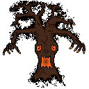

# Equipe: GVIC

## Integrantes:
- Matutino - ADS 5º | [Cesar Koprowski](https://github.com/cesarkoprowski)
- Matutino - ADS 5º | [Ithallo Tulio](https://github.com/ithallotulio)
- Matutino - ADS 5º | [Vannília Lima](https://github.com/Vannilia)
- Matutino - ADS 1º | [Guilherme Feltran]()

## Título:  
**The Last Seed**

## Ferramenta:  
Godot

## Descrição:  
The Last Seed é um jogo de aventura e sobrevivência, ambientado em um mundo devastado pelas mudanças climáticas, onde a civilização desmoronou sob o peso do próprio descaso ambiental. Você joga como um dos últimos humanos em uma Terra árida e cinza, encarregado de uma missão quase impossível: plantar árvores para restaurar o equilíbrio da natureza.

O tempo é curto, e a Terra está longe de ser silenciosa. O calor é extremo e o Espírito da Árvore, uma entidade ancestral corrompida pela fúria e pela dor do descaso ambiental, caça os remanescentes da humanidade. 

Será você capaz de acalmar a entidade ancestral, restaurar o equilíbrio da natureza e salvar um mundo à beira do colapso?

## Temas:
 **Educação de Qualidade**  
   A Fatec será representada como um centro de aprendizado, onde o jogador desenvolve habilidades que o ajudam a enfrentar os desafios encontrados no jogo, evidenciando a influência positiva da educação.

 **Ação contra a mudança global do clima**  
   O ambiente hostil ilustra as consequências reais da crise climática, e o reflorestamento representa um dos métodos para combater e mitigar o aquecimento global.

## Concept Art:

### Entidade Ancestral

